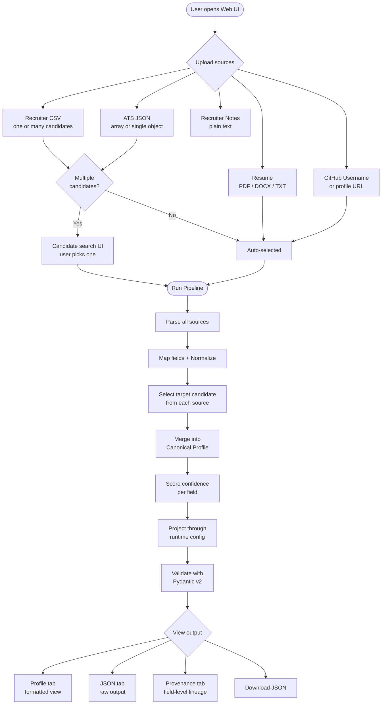
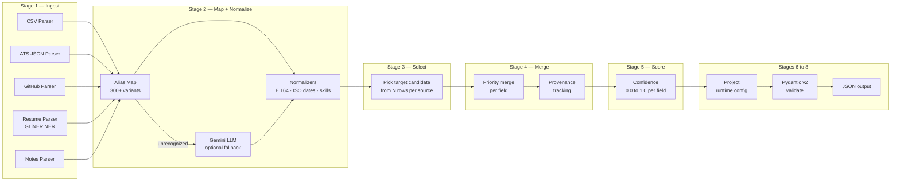
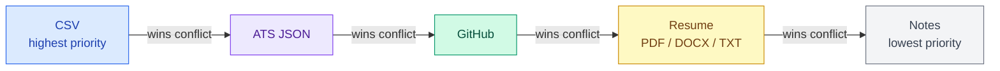

# Multi-Source Candidate Data Transformer

A production-grade pipeline that ingests candidate data from up to five sources simultaneously — Recruiter CSV, ATS JSON, PDF/DOCX Resume, Recruiter Notes, and GitHub profile — normalizes every field, merges them into a single canonical profile, scores confidence, and exposes the result through a clean REST API and interactive web UI.

Built as an Eightfold AI Engineering Assignment by **Arnav Pandey** (IIIT Naya Raipur, 2025 Intern).

---

## User Flow



---

## Pipeline Architecture



---

## Source Merge Priority



Scalar fields (name, title, location): highest-priority non-null value wins.
List fields (skills, experience, education, emails, phones): union-merged across all sources.
Every output field records which source won in the provenance table.

---

## Tech Stack

| Layer | Technology |
|---|---|
| Backend API | FastAPI 0.115 + Uvicorn (ASGI) |
| Data validation | Pydantic v2 |
| NER model | GLiNER (zero-shot named entity recognition) |
| CSV parsing | pandas 2.2 |
| PDF parsing | pdfplumber |
| DOCX parsing | python-docx |
| Phone normalization | phonenumbers (E.164) |
| Date parsing | python-dateutil |
| HTTP client | httpx (async) |
| LLM field mapping | Google Gemini via google-genai (optional) |
| Frontend framework | Next.js 15 + React 18 |
| Language | TypeScript 5 |
| UI components | Radix UI primitives |
| Icons | lucide-react |
| Styling | Tailwind CSS 3.4 + CSS custom properties |
| Fuzzy matching | rapidfuzz |

---

## Project Structure

```
Eightfold-ai/
│
├── api/
│   ├── main.py                   # FastAPI app — all endpoints
│   └── requirements.txt          # Python dependencies
│
├── pipeline/
│   ├── orchestrator.py           # Main async pipeline runner
│   ├── merger.py                 # Multi-source profile merging
│   ├── models.py                 # Pydantic v2 canonical schema
│   ├── scorer.py                 # Field + profile confidence scoring
│   ├── projector.py              # Config-driven output projection
│   ├── llm_mapper.py             # Gemini field-name mapper (optional)
│   │
│   ├── parsers/
│   │   ├── csv_parser.py         # Recruiter CSV -> canonical fields
│   │   ├── ats_json_parser.py    # ATS JSON (array or object) -> fields
│   │   ├── github_parser.py      # GitHub REST API + README parser
│   │   ├── resume_parser.py      # PDF/DOCX/TXT + GLiNER NER
│   │   └── notes_parser.py       # Plain-text recruiter notes
│   │
│   └── normalizers/
│       ├── date_normalizer.py    # ISO 8601 date parsing
│       ├── phone_normalizer.py   # E.164 phone formatting
│       ├── location_normalizer.py
│       └── skills_normalizer.py  # Canonical skill names
│
├── frontend/
│   ├── app/
│   │   ├── page.tsx              # Root page — layout + state
│   │   ├── layout.tsx            # HTML shell
│   │   └── globals.css           # Design tokens + component classes
│   │
│   ├── components/
│   │   ├── InputPanel.tsx        # File uploads + GitHub URL + Run button
│   │   ├── ConfigPanel.tsx       # Output config toggles + field selector
│   │   ├── ProfilePanel.tsx      # Results: Profile / JSON / Provenance tabs
│   │   ├── ProvenancePanel.tsx   # Field lineage table
│   │   └── CandidateSearch.tsx   # Multi-candidate search + selection UI
│   │
│   ├── lib/
│   │   └── api.ts                # Typed fetch wrappers for all endpoints
│   │
│   ├── package.json
│   ├── tailwind.config.ts
│   └── next.config.ts
│
├── samples/
│   ├── sample_candidates.csv     # 5 candidates (Priya, Rohan, Ananya, Vikram, Deepa)
│   ├── sample_ats.json           # 4 candidates as JSON array
│   ├── sample_resume.txt         # Priya Sharma's resume (matches CSV row 1)
│   └── sample_notes.txt          # Recruiter call notes on Priya
│
├── output/
│   ├── sample_output.json        # Pipeline output: all 4 sample files merged (Priya Sharma)
│   └── personal_output.json      # Pipeline output: personal GitHub + resume run
│
├── configs/
│   ├── default_config.json       # Default output field config
│   └── custom_config.json        # Example custom projection config
│
├── tests/                        # pytest test suite
├── .env.example                  # Environment variable template
└── railway.toml                  # Deployment config
```

---

## Quick Start

### Prerequisites

- Python 3.10+
- Node.js 18+
- pip

### 1. Clone the repo

```bash
git clone <repo-url>
cd Eightfold-ai
```

### 2. Backend setup

```bash
cd api
pip install -r requirements.txt
```

Create a `.env` file (both keys are optional — the pipeline works without them):

```bash
# .env
GEMINI_API_KEY=your_key_here       # enables LLM field mapping for unknown columns
GITHUB_TOKEN=ghp_your_token_here   # raises GitHub rate limit from 60 to 5000 req/hr
```

Start the backend:

```bash
uvicorn main:app --reload --port 8000
```

The API is now running at `http://localhost:8000`.
Swagger docs available at `http://localhost:8000/docs`.

### 3. Frontend setup

Open a second terminal:

```bash
cd frontend
npm install
npm run dev
```

The UI is now running at `http://localhost:3000`.

### 4. Try it out

- Click **Run sample data** in the top bar for an instant demo (no file upload needed)
- Or upload any combination of the files in `samples/` and click **Run Pipeline**

---

## Environment Variables

| Variable | Required | Description |
|---|---|---|
| `GEMINI_API_KEY` | No | Enables Gemini LLM fallback for unknown CSV/ATS column names. Without it the alias map handles all recognized fields; unrecognized ones are surfaced in the API response. |
| `GITHUB_TOKEN` | No | Personal access token for GitHub REST API. Without it: 60 requests/hour. With it: 5,000 requests/hour. |
| `NEXT_PUBLIC_API_URL` | No | Override the backend URL for the frontend. Default: `http://localhost:8000`. Useful for production deployments. |

---

## API Reference

### `POST /transform`

Run the full pipeline on uploaded files.

**Form fields:**

| Field | Type | Description |
|---|---|---|
| `csv_file` | File (optional) | Recruiter CSV — any column schema |
| `ats_file` | File (optional) | ATS JSON — array or single object |
| `resume_file` | File (optional) | Resume — PDF, DOCX, or TXT |
| `notes_file` | File (optional) | Recruiter notes — plain text |
| `github_url` | string (optional) | GitHub username or full profile URL |
| `config` | JSON string (optional) | Output projection config (see below) |
| `target_email` | string (optional) | Email of the specific candidate to extract when CSV/ATS has multiple rows |
| `target_name` | string (optional) | Name of the specific candidate to extract |

At least one source must be provided.

**Response:**

```json
{
  "profile": {
    "candidate_id": "sha256-hash",
    "full_name": "Priya Sharma",
    "emails": ["priya@example.com"],
    "phones": ["+919876543210"],
    "location": { "city": "Bangalore", "region": "Karnataka", "country": "India" },
    "headline": "Senior ML Engineer",
    "years_experience": 6.0,
    "skills": [
      { "name": "Python", "confidence": 0.95, "sources": ["csv", "ats_json", "resume"] }
    ],
    "experience": [
      { "company": "Google", "title": "ML Engineer", "start": "2021-06", "end": null }
    ],
    "education": [
      { "institution": "IIT Bombay", "degree": "M.Tech", "field": "AI", "end_year": 2019 }
    ],
    "links": {
      "linkedin": "https://linkedin.com/in/priya-sharma",
      "github": "https://github.com/priyasharma",
      "portfolio": null,
      "other": []
    },
    "overall_confidence": 0.91,
    "provenance": [
      { "field": "full_name", "source": "csv", "method": "direct" }
    ]
  },
  "validation_errors": [],
  "pipeline_errors": [],
  "sources_used": ["csv", "ats_json", "resume", "notes"],
  "unrecognized_fields": {}
}
```

---

### `POST /transform/sample`

Run the pipeline on built-in sample data (CSV + ATS JSON only, no GLiNER). Fast — responds in milliseconds. Used by the **Run sample data** button in the UI.

No request body needed.

---

### `POST /api/candidates`

Lightweight endpoint that lists all candidates found in uploaded CSV/ATS files without running the full pipeline. Used by the frontend to populate the candidate search dropdown.

**Form fields:** `csv_file` (optional), `ats_file` (optional)

**Response:**

```json
{
  "candidates": [
    { "name": "Priya Sharma",  "email": "priya@example.com",  "sources": ["csv", "ats_json"] },
    { "name": "Rohan Mehta",   "email": "rohan@example.com",  "sources": ["csv"] },
    { "name": "James Wilson",  "email": "james@example.com",  "sources": ["ats_json"] }
  ],
  "total": 7
}
```

---

### `GET /health`

Returns `{ "status": "ok" }`. Use for uptime and deployment health checks.

---

## Runtime Output Config

Pass a JSON config string in the `config` form field to control exactly what the output looks like:

```json
{
  "fields": [
    { "path": "full_name",             "type": "string" },
    { "path": "emails[0]",             "type": "string" },
    { "path": "skills[].name",         "type": "string" },
    { "path": "location.country",      "type": "string" },
    { "path": "experience[0].company", "type": "string" }
  ],
  "include_confidence": true,
  "include_provenance": true,
  "on_missing": "null"
}
```

**Path syntax:**

| Pattern | Example | Result |
|---|---|---|
| Simple field | `full_name` | String value |
| Indexed array | `emails[0]` | First email address |
| Array pluck | `skills[].name` | List of all skill names |
| Nested | `location.country` | Country string |

**`on_missing` options:**

| Value | Behavior |
|---|---|
| `null` | Missing fields included as `null` in output |
| `omit` | Missing fields excluded from output entirely |
| `error` | Missing fields added to `validation_errors` list |

---

## Input Format Guide

### Recruiter CSV

Any column schema is accepted — no fixed format required. The parser recognizes 300+ column name variants automatically via an alias map. Unknown columns fall back to the optional Gemini LLM mapper.

**Example recognized column names:**

| Canonical field | Accepted variants |
|---|---|
| `full_name` | name, fullname, candidate_name, applicant |
| `emails` | email, emailaddress, contact_email, mail, e-mail |
| `phones` | phone, mobile, cell, contact_number, tel, telephone |
| `skills` | skills, competencies, tech_stack, technologies, expertise |
| `years_experience` | years, yoe, total_experience, years_of_experience |

Multiple rows are handled by the candidate selection logic (see below).

### ATS JSON

Accepts both a single JSON object and an array of candidate objects. Nested dicts are flattened with dot-notation. Lists (skills, experience, education) are always kept intact.

```json
[
  {
    "applicant_name": "Priya Sharma",
    "contact_email": "priya@example.com",
    "competencies": ["Python", "TensorFlow", "Kubernetes"],
    "experience": [
      { "company": "Google", "title": "ML Engineer", "start": "2021-06", "end": null }
    ],
    "education": [
      { "institution": "IIT Bombay", "degree": "M.Tech", "field": "AI", "end_year": 2019 }
    ]
  }
]
```

### Resume

Supported formats: `.pdf`, `.docx`, `.txt`

The resume parser runs a 7-layer extraction pipeline:
1. Regex for emails, URLs, LinkedIn, GitHub
2. Phone extraction + E.164 normalization
3. GLiNER NER (person name, org, job title, university, degree, skill)
4. nameparser for human name cleaning
5. Canonical skills keyword scan
6. Date range extraction for experience entries
7. Education pattern matching

GLiNER model loads on first use (~20-40 seconds) and is cached at module level — subsequent calls complete in ~1-2 seconds.

### GitHub

Accepts a username (`torvalds`), a bare URL (`github.com/torvalds`), or a full URL.

Extracted data:
- Profile: name, bio, company, location, email, followers, public repo count
- Repository languages aggregated by byte count (converted to skills)
- Profile README: emails, external links, headline, additional skills
- Repo topics as additional skill signals
- Image URLs, CDN assets, and badge URLs are filtered out automatically

Rate limits: 60 requests/hour without `GITHUB_TOKEN`, 5,000/hour with it.

---

## Candidate Selection Logic

When CSV or ATS JSON contains multiple candidates, the pipeline uses a three-tier strategy per source independently:

```
Priority 1 — Explicit match
  target_email or target_name set by the UI (user-selected candidate)

Priority 2 — Cross-source overlap
  Name or email found in another source (resume, GitHub, notes)

Priority 3 — First row fallback
  Used only when no explicit target and no other signals are available
```

If the target is not found in a source (e.g. an ATS-only candidate has no CSV row), that source returns an empty record set and contributes nothing to the merge. This prevents data from one person bleeding into another's profile.

**When resume or GitHub is present:** The UI skips candidate selection entirely. The pipeline uses the resume or GitHub name and email to perform cross-source matching automatically — no user action needed.

---

## Confidence Scoring

Each field in the output carries a confidence score from 0.0 to 1.0.

**Base confidence by source:**

| Source | Base weight |
|---|---|
| CSV | 1.0 |
| ATS JSON | 1.0 |
| GitHub | 0.85 |
| Resume (PDF/DOCX/TXT) | 0.70 |
| Notes | 0.60 |

**Modifiers:**
- Conflict penalty: -0.20 when two sources disagree on the same field
- Corroboration bonus: +0.10 when two or more sources agree (capped at 1.0)

**Profile-level confidence:** Weighted average across key fields (name, emails, phones, skills, experience, education).

---

## Hybrid Field Mapping

Unknown CSV or ATS column names go through a two-stage process:

```
Raw column name
      |
      v
  Alias Map (300+ hand-curated variants, O(1) lookup, zero cost, deterministic)
      |
      |-- Match found --> Canonical key
      |
      --> No match --> Gemini LLM (only if GEMINI_API_KEY is set, temperature=0)
                            |
                            |-- Mapped --> Canonical key
                            --> null   --> Added to unrecognized_fields in response
```

The LLM call uses `temperature=0` for deterministic output — the same unknown field always maps to the same canonical key across runs. It is completely optional: if `GEMINI_API_KEY` is not set the pipeline runs end-to-end on the alias map alone, and any unrecognized fields are surfaced in the API response so the caller knows what was dropped.

---

## Sample Data

The `samples/` directory contains a pre-built test dataset:

| File | Contents |
|---|---|
| `sample_candidates.csv` | 5 Indian tech professionals. Priya Sharma and Vikram Nair also appear in the ATS JSON (cross-source overlap). |
| `sample_ats.json` | 4 candidates as a JSON array. Priya and Vikram overlap with CSV. Zara Ahmed and James Wilson are ATS-only. |
| `sample_resume.txt` | Priya Sharma's resume. Matches CSV row 1 and ATS record 0. Use to test 3-source merging. |
| `sample_notes.txt` | Recruiter call notes on Priya. Tests sentiment detection and free-text NER. |

**Test scenarios:**

| Upload | Expected behavior |
|---|---|
| CSV + ATS only | Shows 7 candidates in the search UI. Pick any one. |
| CSV + ATS + Resume | No candidate selection needed. Pipeline auto-matches via resume name/email. |
| CSV + ATS + Resume + Notes | Full 4-source merge on Priya Sharma. |
| Resume only | GLiNER-only extraction from the text file. |
| Click "Run sample data" | Instant demo on Priya Sharma using CSV + ATS JSON. |

---

## Key Design Decisions

**Dedicated Select stage**
Real-world recruiter CSVs and ATS exports contain entire talent pools. The Select stage handles multi-candidate files without requiring preprocessing — users pick via the search UI, or the pipeline auto-matches using cross-source signals. This is more robust than assuming single-candidate input.

**LLM as optional fallback, not primary path**
The alias map handles 95%+ of common column names with zero cost and zero latency. The LLM is invoked only for genuinely novel column names and runs at `temperature=0` for reproducibility. The system works fully without a Gemini API key.

**Per-field confidence, not per-profile**
Different fields come from sources of different reliability. A candidate's email from a recruiter CSV (1.0 confidence) and their skill list parsed from a PDF resume (0.70 base) are not equally reliable. Downstream systems can act on per-field confidence rather than discarding nuance.

**Never raise, always return**
Every parser and pipeline stage catches all exceptions internally. The caller always receives a best-effort result plus a `pipeline_errors` list describing what failed. A bad PDF does not prevent the CSV and GitHub data from being returned.

**Pydantic v2 at the output boundary**
Unknown fields cannot enter the canonical schema. Type coercion is explicit. Validation errors are collected and returned rather than thrown, so partial results are still usable.

---

## Sample Outputs

The `output/` directory contains two real pipeline runs committed to the repo.

### `output/sample_output.json` — All 4 sample sources merged

**Input:** `sample_candidates.csv` + `sample_ats.json` + `sample_resume.txt` + `sample_notes.txt`
**Candidate:** Priya Sharma (matched across CSV, ATS JSON, and resume)
**Sources used:** `csv`, `ats_json`, `resume_txt`, `notes`

Key results:
- **21 skills** union-merged across all four sources. Skills confirmed by 3+ sources (Python, TensorFlow, MLOps) scored confidence 1.0. Resume-only skills (SQL, Spark, Airflow) scored 0.7.
- **3 experience entries** extracted — Google (current, from CSV + ATS), Flipkart (from resume).
- **2 education entries** — M.Tech IIT Bombay, B.Tech NIT Trichy.
- **Overall confidence: 0.95** — high because all key fields were confirmed by multiple sources.
- Provenance shows `csv` won on name, email, phone, location, links. `resume_txt` won on headline and experience. Skills sourced from `merged` (union).

### `output/personal_output.json` — GitHub + Resume only

**Input:** Personal GitHub profile (`letusnotc`) + personal PDF resume
**Candidate:** Arnav Pandey
**Sources used:** `github`, `resume_pdf`

Key results:
- Skills extracted from both GitHub repository languages and resume — JavaScript, Python, Machine Learning, XGBoost, LightGBM, CatBoost, AutoGluon, PyTorch, TensorFlow and more, all at confidence 0.95 (corroborated by both sources).
- Contact: email and phone extracted from resume.
- Links: GitHub profile URL and any other links from README parsed automatically.
- Demonstrates the pipeline working with zero structured data — only unstructured inputs (GitHub + PDF).

---

## Known Limitations

- GLiNER model requires ~500 MB RAM and takes 20-40 seconds to load on first call. It is not loaded if no resume or notes file is provided.
- GitHub parsing requires network access and will fail gracefully if the profile is private or the rate limit is exceeded.
- The LLM mapper sends only field names and truncated sample values (80 chars max) to Gemini — no candidate PII is included in the prompt.
- PDF parsing accuracy depends on the PDF's text layer. Scanned PDFs without OCR produce minimal output.
- Date normalization uses heuristic parsing and may produce incorrect results for ambiguous date strings (e.g. `03/04/2022`).
- The pipeline processes one candidate at a time. Bulk processing of an entire CSV as separate profiles is descoped.
